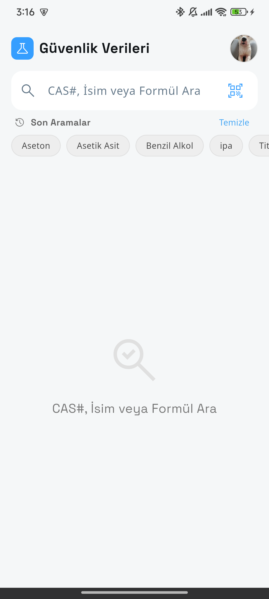
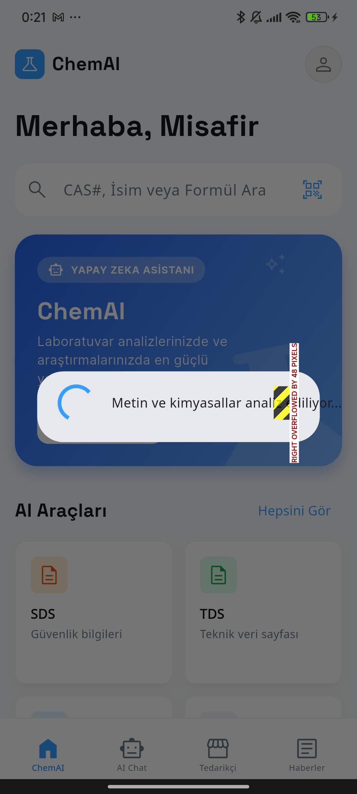
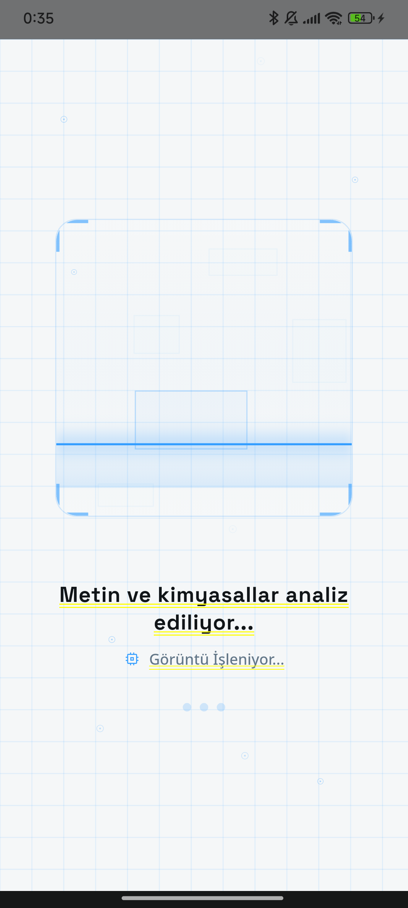
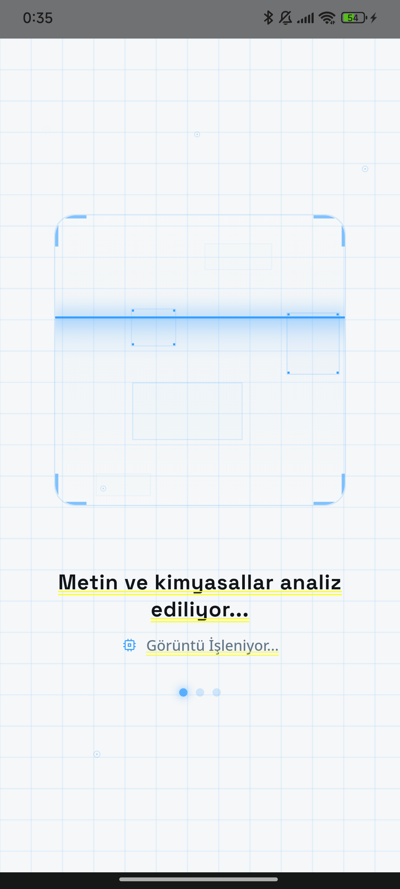
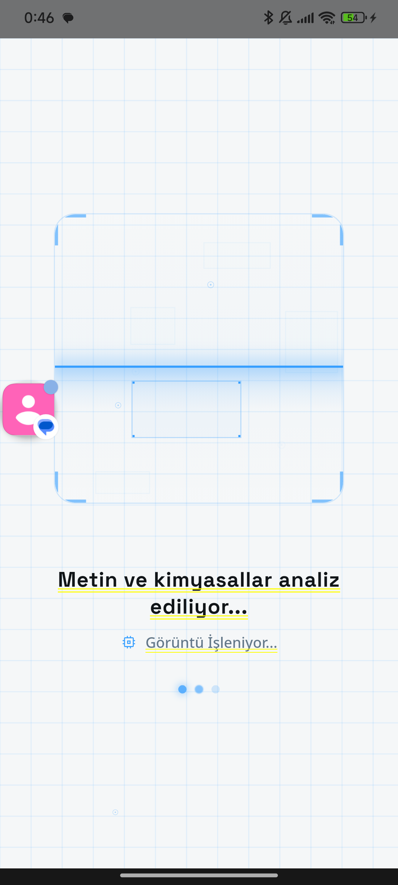

# 🧪 ChemAI - Intelligent Chemical Assistant

ChemAI is a high-performance, cross-platform mobile application built with **Flutter** designed to revolutionize the way chemical data is managed, analyzed, and shared. From AI-powered reaction assistance to automated Safety Data Sheet (SDS) analysis, ChemAI provides a comprehensive suite of tools for chemical engineers, lab technicians, and industry professionals.

---

## ✨ Key Features

### 🤖 AI Reaction & Safety Assistant
- **Smart Chat**: Interact with an AI trained on chemical compatibility, reaction mechanisms, and safety protocols.
- **Reaction Analysis**: Get instant feedback on chemical mixtures and potential hazards.

### 📄 Document Intelligence (SDS & TDS)
- **SDS Analyzer**: Upload or scan Safety Data Sheets to extract critical safety information automatically using Google ML Kit OCR.
- **Technical Data Sheets (TDS)**: Generate, view, and manage comprehensive technical documents for chemical products.
- **Custom Generation**: Professional PDF generation for SDS and TDS reports with customized company branding.

### 🔍 Industry Tools
- **Supplier Search**: Find and connect with chemical suppliers globally.
- **Raw Material Database**: Detailed information, properties, and safety data for a wide range of raw materials.
- **Barcode & OCR Scanner**: High-speed scanning for quick access to material data and documentation.

### 🏢 Enterprise Management
- **Company Profiles**: Manage multiple company identities for document branding.
- **Subscription Model**: Tiered access with "Plus Membership" for advanced features and unlimited analysis.

---

## 🛠️ Tech Stack

- **Framework**: [Flutter](https://flutter.dev/) (3.10.4+)
- **Backend as a Service**: [Supabase](https://supabase.com/)
- **Cloud Infrastructure**: [Firebase](https://firebase.google.com/) (Messaging, Analytics, Crashlytics)
- **AI/ML**: Google ML Kit (Text Recognition)
- **Database**: PostgreSQL (via Supabase)
- **Storage**: Supabase Storage for document and image hosting
- **UI Architecture**: Clean Architecture with modular screen structure

---

## 📁 Project Structure

```text
lib/
├── core/           # Core utilities, constants, and theme configurations
├── data/           # Data layer (repositories, local storage)
├── l10n/           # Internationalization (Localization) files
├── models/         # Data models and entities
├── screens/        # UI Screens (UI Layer)
│   ├── ai_chat/    # AI interaction screens
│   ├── sds_tds/    # Document management screens
│   └── company/    # Company management screens
├── services/       # API services (Supabase, Firebase, ML Kit)
└── widgets/        # Reusable UI components
```

---

## 🚀 Getting Started

### Prerequisites

- Flutter SDK (>= 3.10.4)
- Dart SDK (>= 3.0.0)
- Android Studio / VS Code with Flutter extension
- Firebase Project setup
- Supabase Project setup

### Installation

1. **Clone the repository**
   ```bash
   git clone https://github.com/your-repo/chem-ai.git
   cd ChemAI
   ```

2. **Install dependencies**
   ```bash
   flutter pub get
   ```

3. **Environment Setup**
   - Update `firebase_options.dart` with your Firebase configuration.
   - Configure Supabase credentials in your initialization code.

4. **Run the Application**
   ```bash
   flutter run
   ```

---

## 📱 Application Gallery

| Home Screen | AI Chat | SDS Analyzer |
| :---: | :---: | :---: |
|  |  |  |

| Supplier Search | Raw Materials | TDS View |
| :---: | :---: | :---: |
|  |  |  |

---

## 🛡️ Security & Privacy

- **Row Level Security (RLS)**: Data access is strictly controlled at the database level via Supabase.
- **Biometric/Auth**: Secure login and signup powered by Firebase/Supabase Auth.
- **Data Encryption**: Sensitive API keys and user data are handled using industry-standard protocols.

---

## 📄 License

Copyright © 2026 ChemAI Team. All rights reserved.

---

**ChemAI** - *Empowering Chemistry with Intelligence.* 🧪⚡
